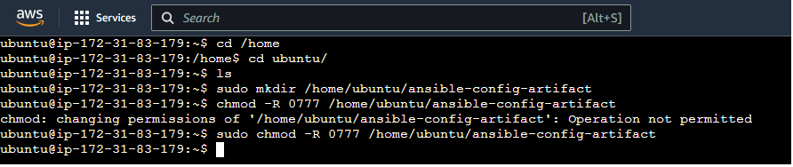
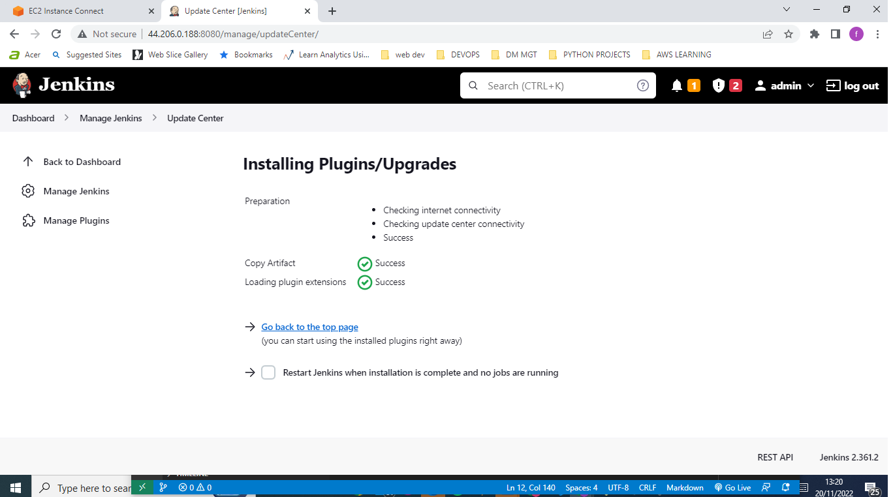
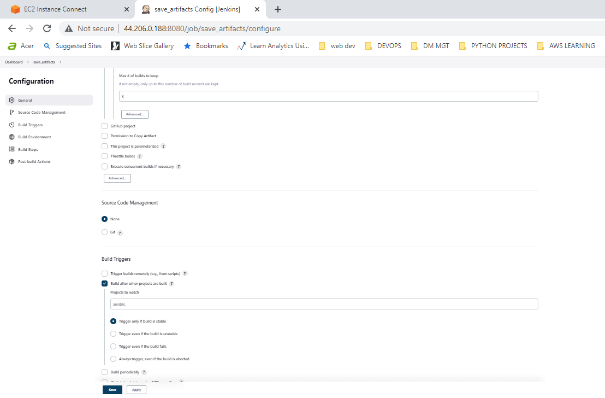
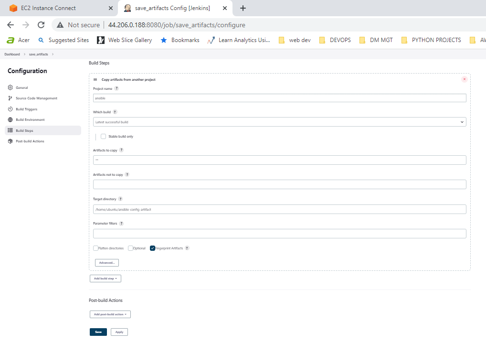
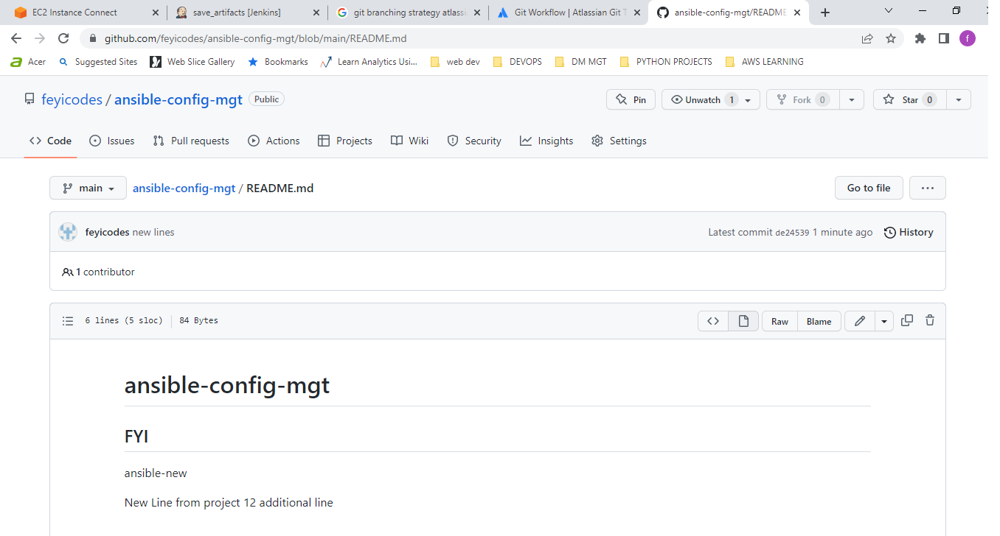
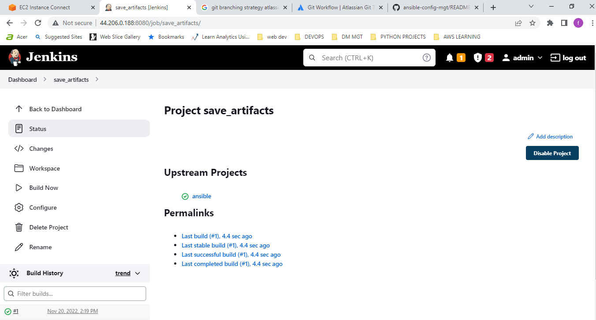
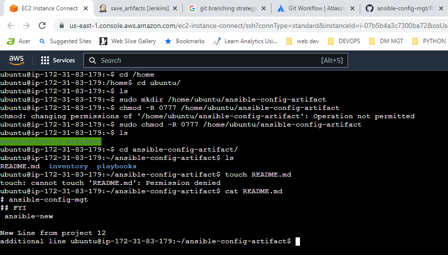

## ANSIBLE REFACTORING AND STATIC ASSIGNMENTS (IMPORTS AND ROLES)

### INRODUCTION
The underlying philosophy behind Devops is based on constant iterative improvement for better efficiency. Hence Devops engineers strive to:
* Make  monotonous/iterative tasks effective 
* Improving the code pipeline
* Reducing runtime
* Code Refactoring

Refactoring is a general term used in computer programming which means changes to source code without changing the expected behaviour of the software. Refactoring enhances code readability, increases maintainability and extensibility, reduce complexity and allows for the addition of proper comments without affecting the logic.

This project is a continuum of the *ansible-config-mgt* repository implemented in project 11. Most Ansible users have the habit of using the one-file approach. Here, I made some improvement on my code by refactoring my Ansible code, create new assignments and used the imports functionality; allowing the usage of previously created playbooks in a new playbook. 

### JENKINS JOB ENHANCEMENT
The current jenkins job configuration is such that every change in code creates a separate directory. This would be inconvenient when running commands from one place and also consumes space on Jenkins servers with each subsequent change.

I created a new directory named ansible-config-artifact and changed the permission of folder to allow Jenkins save files in the directory. 

I installed the *copy artifact* from the Jenkins Manage plugin page without restarting Jenkins.

I created a new Freestyle project named **save_artifacts**. and configured it accorndingly by choosing *discard old builds* option and select **ansible** as project to watch, ensure it copy all artifacts and choose the /home/ubuntu/ansible-config-artifact as target directory.

Afterwards, I edited the README.md file in the **ansible-config-mgt** repository and the change reflected on the save-artifacts project and also in the /home/ubuntu/ansible-config-artifact directory.

In order to carry out a neat and presentable code refactoring, I created a site.yml file in the playbooks directory and created a new directory named static-assignments where I placed the common.yml file. 

I ran the site.yml anksible playbook in the dev environment

Afterwards, I created common-del.yml file in the static-assignments directory with tasks of kdeleting wireshark from all servers and edited the content of the site.yml to include the path of newly created file. 

Once again, I ran the site.yml playbook in the dev environment and tested to confirm that wireshark has been uninstalled from the servers.

