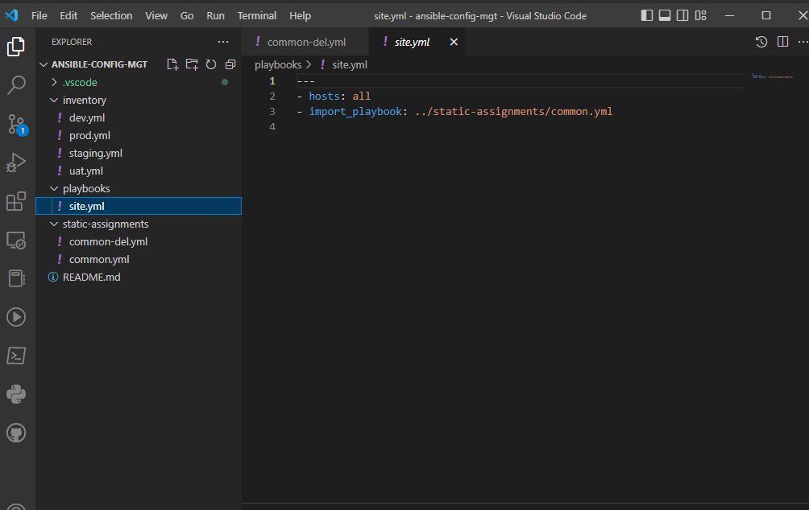
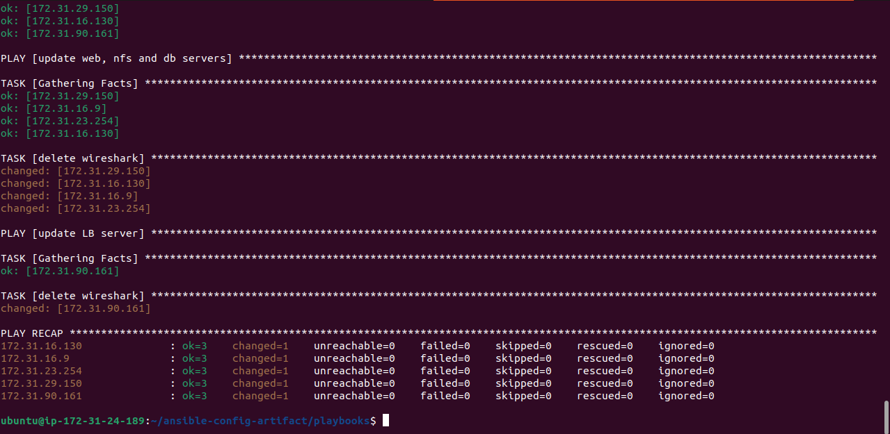
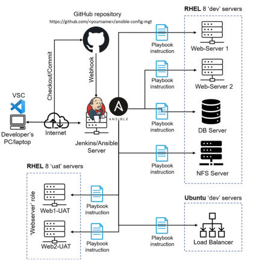

## ANSIBLE REFACTORING AND STATIC ASSIGNMENTS (IMPORTS AND ROLES)

### INRODUCTION
The underlying philosophy behind Devops is based on constant iterative improvement for better efficiency. Hence Devops engineers strive to:
* Make  monotonous/iterative tasks effective 
* Improving the code pipeline
* Reducing runtime
* Code Refactoring

Refactoring is a general term used in computer programming which means changes to source code without changing the expected behaviour of the software. Refactoring enhances code readability, increases maintainability and extensibility, reduce complexity and allows for the addition of proper comments without affecting the logic.

This project is a continuum of the *ansible-config-mgt* repository implemented in project 11. Most Ansible users have the habit of using the one-file approach. Here, I made some improvement on my code by refactoring my Ansible code, create new assignments and used the imports functionality; allowing the usage of previously created playbooks in a new playbook. 

### JENKINS JOB ENHANCEMENT
The current jenkins job configuration is such that every change in code creates a separate directory. This would be inconvenient when running commands from one place and also consumes space on Jenkins servers with each subsequent change.

I created a new directory named ansible-config-artifact and changed the permission of folder to allow Jenkins save files in the directory. 


I installed the *copy artifact* from the Jenkins Manage plugin page without restarting Jenkins.


I created a new Freestyle project named **save_artifacts**. and configured it accorndingly by choosing *discard old builds* option and select **ansible** as project to watch, ensure it copy all artifacts and choose the /home/ubuntu/ansible-config-artifact as target directory.


Afterwards, I edited the README.md file in the **ansible-config-mgt** repository and the change reflected on the save-artifacts project and also in the /home/ubuntu/ansible-config-artifact directory.


### DEV ENVIRONMENT CONFIGURATIONS
In order to carry out a neat and presentable code refactoring, I created a site.yml file in the playbooks directory and created a new directory named static-assignments where I placed the common.yml file. 


Afterwards, I added the path to the inventory on **ansible.cfg** file.


I inputted the necesssary code and ran the site.yml ansible playbook in the dev environment



Afterwards, I created common-del.yml file in the static-assignments directory with tasks of deleting wireshark from all servers and edited the content of the site.yml to include the path of newly created file. 


I tested the connection of the jenkins server with the others servers.


Afterwards, I ran the site.yml playbook in the dev environment and tested to confirm that wireshark has been successfully uninstalled from the servers.





### UAT ENVIRONMENT CONFIGURATIONS
The UAT environment consists of 2 new web servers (RHEL instances) and the Ansible server for configuration. Instead of writing tasks to configure the web servers, we create a dedicated **role** in order to make our configuration reusable.

I created and launched 2 EC2 instances and named them web1-UAT and web2-UAT.


Afterwards, I created a role with directories titled **roles** relative to the playbook file. with the structure as shown below:
```
    └── webserver
    ├── README.md
    ├── defaults
    │   └── main.yml
    ├── handlers
    │   └── main.yml
    ├── meta
    │   └── main.yml
    ├── tasks
    │   └── main.yml
    └── templates
```


I updated **ansible-config-mgt/inventory/uat.yml** file with the IP addresses of the 2 UAT Servers.

```yaml
    [uat-webservers]
    <Web1-UAT-Server-Private-IP-Address> ansible_ssh_user='ec2-user' 

    <Web2-UAT-Server-Private-IP-Address> ansible_ssh_user='ec2-user' 
```

I activated the roles_path string in /etc/ansible/ansible.cfg by including the path /home/ubuntu/ansible-config-artifact/roles informing ansible knows where to find configured roles.


Afterwards, I wrote configuration tasks into the roles/webserver/task/main.yml file to carry out the following actions on the UAT servers:
* Install and configure Apache (httpd service)
* Cloned the *tooling website* from github
* Ensure the tooling website code is deployed to /var/www/html on the 2 UAT web servers
* Ensure httpd service is started'

The constituent of the main.yml file is as follows:

```yaml
    ---
    - name: install apache
    become: true
    ansible.builtin.yum:
        name: "httpd"
        state: present

    - name: install git
    become: true
    ansible.builtin.yum:
        name: "git"
        state: present

    - name: clone a repo
    become: true
    ansible.builtin.git:
        repo: https://github.com/<your-name>/tooling.git
        dest: /var/www/html
        force: yes

    - name: copy html content to one level up
    become: true
    command: cp -r /var/www/html/html/ /var/www/

    - name: Start service httpd, if not started
    become: true
    ansible.builtin.service:
        name: httpd
        state: started

    - name: recursively remove /var/www/html/html/ directory
    become: true
    ansible.builtin.file:
        path: /var/www/html/html
        state: absent
```

I created a new assignment for uat-webservers **uat-webservers.yml** within the **static-assignments** folder where I referenced the role.

```yaml
    ---
    - hosts: uat-webservers
    roles:
     - webserver
```

I updated the **site.yml** file; being the entry point to the ansible configuration with reference to the **uat-webservers.yml**.

```yaml
    ---
    - hosts: all
    - import_playbook: ../static-assignments/common.yml

    - hosts: uat-webservers
    - import_playbook: ../static-assignments/uat-webservers.yml
```

Afterwards, I committed all changes, create a pull request and merge it to the **main** branch, then confirm the consequent **jenkins jobs** are updated into the **/home/ubuntu/ansible-config-artifact/** directory.

I ran the playbook against the **uat** inventory successfully.


 Finally, I sucessfully reached the **uat webservers** from my browser.
    


The final architecture of the Ansible-configured network is as shown below.

